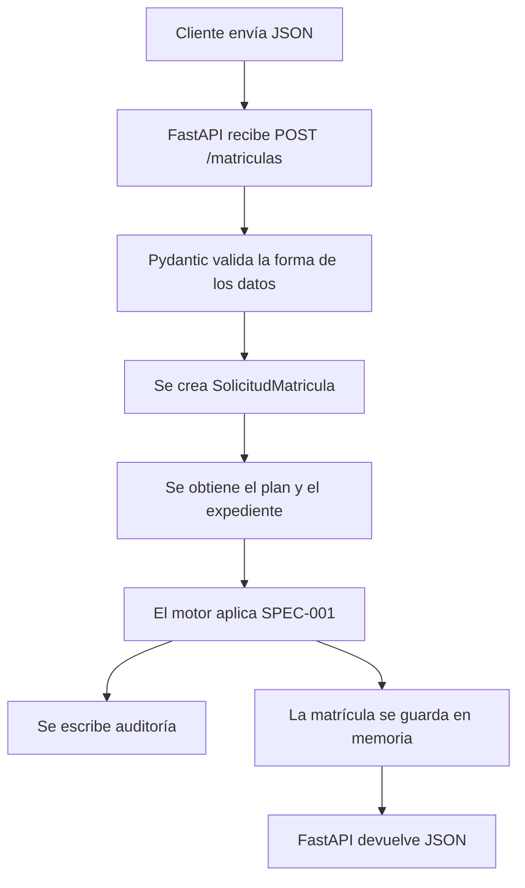

# S1 explicado desde cero

Este documento explica qué construimos en S1, cómo se conectan las piezas y
qué queda por comprobar antes de dar la estación por cerrada. Está pensado para
alguien que empieza: no presupone que ya conozcas FastAPI, Uvicorn, Docker,
pytest o GitHub Actions.

## 1. Qué estamos construyendo

El proyecto Aula es un servicio para gestionar partes de la vida académica de
un estudiante. En S1 construimos la primera funcionalidad: **recibir una
solicitud de matrícula y decidir qué asignaturas se admiten**.

La palabra “rebanada vertical” describe una funcionalidad que cruza todas las
capas necesarias para funcionar:

1. Una persona o un programa envía una petición HTTP.
2. La API recibe y valida los datos.
3. El motor aplica las reglas académicas.
4. El resultado se guarda en memoria y se escribe una traza de auditoría.
5. La API devuelve una respuesta HTTP.
6. Las pruebas y el pipeline comprueban el cambio.

No estamos construyendo una web con pantallas de matrícula. S1 pide una API:
una aplicación que recibe y devuelve datos por HTTP. FastAPI también genera una
página sencilla para explorar la API en `/docs`, pero esa página es una ayuda
para desarrollo, no una interfaz de usuario completa.

El resto del producto se desarrolla en estaciones posteriores. Por ejemplo,
`GET /expedientes/{estudiante_id}` queda pendiente para S2.

## 2. El recorrido de una solicitud

El flujo normal de `POST /matriculas` es este:



En este proyecto, las partes principales están en:

| Archivo | Responsabilidad |
|---|---|
| `src/aula/api/app.py` | Define las rutas HTTP, valida las peticiones y devuelve respuestas. |
| `src/aula/reglas/motor.py` | Aplica las reglas de matrícula de SPEC-001. |
| `src/aula/dominio/modelos.py` | Define los datos académicos y las matrículas. |
| `src/aula/dominio/estados.py` | Define qué cambios de estado puede hacer una matrícula. |
| `src/aula/reglas/planes.py` | Lee el plan académico desde un archivo JSON. |
| `datos/planes/PLAN-2024.json` | Contiene asignaturas, créditos y prerrequisitos del plan. |
| `src/aula/auditoria.py` | Escribe una línea JSON por decisión de matrícula. |
| `tests/` | Comprueba las reglas y las rutas de la API. |

## 3. Conceptos de API, FastAPI y Uvicorn

### 3.1 ¿Qué es una API?

Una API es una forma acordada para que dos programas se comuniquen. En nuestro
caso, el cliente envía datos a una dirección del servicio y recibe una
respuesta. No necesita conocer cómo están escritas las reglas internas.

La comunicación usa HTTP, el mismo protocolo que usa un navegador para pedir
una página. Una ruta HTTP combina una dirección y una acción, por ejemplo:

- `GET /salud`: pide el estado del servicio.
- `POST /matriculas`: envía una solicitud nueva de matrícula.
- `GET /docs`: abre la documentación interactiva que crea FastAPI.

`GET` normalmente consulta información. `POST` normalmente envía datos para
crear o procesar algo.

### 3.2 ¿Qué es FastAPI?

FastAPI es la biblioteca de Python con la que declaramos las rutas y sus
comportamientos. En `app.py` se crea la aplicación:

```python
app = FastAPI(title="Aula Students", version="1.0.0")
```

Las líneas `@app.get(...)` y `@app.post(...)` registran las rutas. Por ejemplo,
`@app.post("/matriculas")` conecta las peticiones `POST /matriculas` con la
función `crear_matricula`.

FastAPI también genera `/docs`. Desde esa página se puede ver qué rutas hay y
enviar peticiones de prueba sin escribir un cliente aparte.

### 3.3 ¿Qué es Pydantic?

Pydantic revisa que el JSON recibido tenga la forma esperada antes de que la
función de la ruta lo procese. `SolicitudEntrada` define los campos esperados:

```python
class SolicitudEntrada(BaseModel):
    estudiante_id: str
    curso_academico: str
    codigos: list[str] = Field(min_length=1)
    momento: str | None = None
```

Por ejemplo, `codigos` tiene que ser una lista y debe contener al menos un
código. El validador `codigos_sin_repetir` comprueba que la lista no repita una
asignatura. Si la forma no es válida, FastAPI responde con un error HTTP 422.

### 3.4 ¿Qué es Uvicorn?

Uvicorn es el programa que pone la aplicación FastAPI a escuchar peticiones de
red. FastAPI define cómo responde el servicio; Uvicorn lo arranca y mantiene
abierto el puerto para recibir peticiones.

Este comando, ejecutado desde la raíz del repositorio en PowerShell, arranca el
servicio:

```powershell
$env:PYTHONPATH = "src"
.\.venv\Scripts\python.exe -m uvicorn aula.api.app:app --host 127.0.0.1 --port 8000
```

Qué significa cada parte:

- `PYTHONPATH = "src"` le indica a Python dónde encontrar el paquete `aula`.
- `python.exe -m uvicorn` ejecuta Uvicorn desde el entorno virtual del proyecto.
- `aula.api.app:app` se lee como `paquete.módulo:variable`: busca la variable
  `app` dentro de `src/aula/api/app.py`.
- `--host 127.0.0.1` limita las conexiones a tu propio ordenador.
- `--port 8000` elige el puerto local que usará el servicio.

Mientras Uvicorn está ejecutándose, esa terminal queda ocupada. En el navegador
se puede abrir `http://127.0.0.1:8000/docs`. Se para volviendo a la terminal y
pulsando Ctrl+C.

La ruta `/` no está definida, así que visitar `http://127.0.0.1:8000/` devuelve
404. Eso es normal. `/salud` sí está definida y responde con estado `ok`.

## 4. Cómo funciona cada ruta

### 4.1 `GET /salud`

Esta ruta es una comprobación rápida de que el servicio está activo. Devuelve un
JSON parecido a este:

```json
{
  "estado": "ok",
  "momento": "2026-10-09T10:00:00+00:00"
}
```

No matricula a nadie ni consulta datos académicos.

### 4.2 `POST /matriculas`

Esta es la funcionalidad principal de S1. El cliente puede enviar, por ejemplo:

```json
{
  "estudiante_id": "EST-0001",
  "curso_academico": "2026-2027",
  "codigos": ["MAT101"],
  "momento": "2026-09-10T10:00:00"
}
```

El servicio convierte esos datos en un objeto `SolicitudMatricula` y llama a
`evaluar_solicitud`. Si falta `momento`, la API usa la hora UTC actual. Si la
solicitud se procesa, guarda la matrícula en el diccionario `MATRICULAS` y
devuelve el resultado como JSON.

El almacenamiento es **en memoria**: los datos viven mientras el proceso de
Uvicorn siga encendido y se pierden al reiniciar el servicio. Esto es adecuado
para la primera versión del laboratorio, pero no es una base de datos para una
aplicación real.

El endpoint usa un plan `PLAN-2024`, un periodo de matrícula fijado en el código
y expedientes nuevos vacíos. El diccionario `GRUPOS` está vacío en esta versión
de la API, lo que significa que la API no impone un límite de plazas por grupo.
El motor sí sabe gestionar grupos llenos, y esa regla se prueba directamente en
los tests del dominio.

### 4.3 `GET /expedientes/{estudiante_id}`

Esta ruta devuelve 501 con el mensaje de que está pendiente en S2. El código 501
significa que el servidor aún no implementa esa función. No es un fallo de S1:
la consulta del expediente pertenece a la siguiente estación.

### 4.4 Códigos HTTP que aparecen en esta API

- `200`: la petición se procesó correctamente.
- `409`: la solicitud llegó fuera de la ventana de matrícula.
- `422`: los datos enviados no pasan la validación.
- `501`: esa ruta todavía no está implementada; en este caso corresponde a S2.
- `404`: no existe una ruta para la dirección solicitada; por ejemplo, `/`.

## 5. El dominio y las reglas académicas

El dominio es la parte del programa que representa el problema académico. Aquí
están estudiantes, asignaturas, planes, expedientes y matrículas. La idea es
mantener estas reglas separadas de HTTP: así se pueden probar sin arrancar el
servidor.

### 5.1 Plan y asignaturas

`datos/planes/PLAN-2024.json` describe el plan. Por ejemplo, puede indicar que
`PRG102` vale nueve créditos y tiene como prerrequisito `PRG101`. El código de
`planes.py` lee ese JSON y crea objetos `Plan` y `Asignatura`.

El plan tiene además valores como el límite normal de créditos del curso, el
número máximo de convocatorias y el umbral de créditos para el tramo final de la
carrera.

### 5.2 Expediente

Un expediente es la lista de resultados previos de un estudiante. Un registro
académico contiene una asignatura, curso, número de convocatoria, estado y nota
opcional. Los estados de registro incluyen aprobada, suspensa, no presentado y
convalidada.

En S1 una asignatura aprobada o convalidada cuenta como superada. Las
convalidaciones también cuentan para los créditos superados y no consumen una
convocatoria.

### 5.3 Motor de matrícula

`evaluar_solicitud` recorre los códigos en el orden escrito en la solicitud. Por
cada asignatura comprueba las reglas pertinentes:

1. ¿La solicitud llegó dentro de la ventana? Si no, se rechaza la solicitud
   completa con `VentanaCerrada`.
2. ¿El estudiante ya superó la asignatura? Si sí, esa línea se rechaza.
3. ¿Ha superado los prerrequisitos? Si no, se rechaza esa línea y se indican
   los prerrequisitos pendientes.
4. ¿Ha agotado las convocatorias? Si sí, se rechaza esa línea.
5. ¿El grupo está lleno? Si sí, la línea queda en espera y no consume créditos.
6. ¿Admitirla supera el límite de créditos? Si sí, esa línea se rechaza.
7. Si no se cumple ninguno de esos motivos, se admite la línea.

La spec da prioridad al rechazo por prerrequisito cuando también está lleno el
grupo. Por eso el motor comprueba los prerrequisitos antes de comprobar las
plazas.

En el tramo final de carrera, el límite efectivo puede cambiar: si los créditos
pendientes para acabar el título están en o por debajo del umbral indicado por
el plan, se permite solicitar hasta esa cantidad pendiente.

`creditos_superados` y `creditos_pendientes` hacen esos cálculos. `prioridad`
calcula los créditos superados y `ordenar_por_prioridad` pone primero al
estudiante con más créditos superados y, en empate, la solicitud más antigua.

### 5.4 Ventanas y fechas

`VentanaMatricula.contiene` decide si un momento cabe entre las fechas de inicio
y fin. Ambas puntas están incluidas: una solicitud exactamente al inicio o al
fin todavía está dentro de la ventana.

Los momentos se reciben en formato ISO-8601. Ese formato escribe fecha y hora
de forma estándar, por ejemplo `2026-09-10T10:00:00`. Puede incluir zona
horaria; el motor convierte las fechas a UTC para compararlas.

### 5.5 Estados y transiciones

Una matrícula cambia de estado a medida que avanza. El modelo define estados
como solicitada, validada, confirmada, en curso, calificada, cerrada y anulada.
`TRANSICIONES` declara qué estados se permiten como siguiente paso.

`transicionar` rechaza un salto no permitido con `TransicionInvalida`. Una vez
confirmada la matrícula, el plan que se aplicó no se puede cambiar; un intento
de hacerlo produce `PlanInmutable`.

La spec fija el invariante del plan inmutable después de confirmar. Los detalles
del ciclo de vida que no estén fijados en la spec son convenciones de esta
implementación inicial.

## 6. Auditoría

Una decisión académica debe poder explicarse después. Para eso el código llama a
`registrar_decision`, que añade una línea JSON a `.aula/auditoria.jsonl`. Cada
línea incluye el estudiante, curso, código y versión del plan, momento y
resultado.

El formato JSON Lines almacena un objeto JSON por línea. Es fácil añadir una
decisión sin reescribir las anteriores. La ruta de auditoría puede configurarse
con `AULA_TRAZA`; por defecto está dentro de `.aula/`.

La carpeta `.aula/` contiene estado local del laboratorio y parte de ella está
ignorada por Git. No la confundas con la persistencia de matrículas: el
diccionario `MATRICULAS` vive en la memoria del proceso, mientras que la traza
se escribe en un archivo.

## 7. Pruebas y cobertura

### 7.1 ¿Qué es una prueba?

Una prueba ejecuta un ejemplo conocido y comprueba que el resultado coincide
con lo esperado. En pytest, una función cuyo nombre empieza por `test_` puede
ser detectada automáticamente. `assert resultado == esperado` expresa lo que
debe cumplirse.

`tests/test_reglas_matricula.py` prueba las reglas del motor;
`tests/test_estados_matricula.py` prueba las transiciones de estado; y
`tests/test_api_matricula.py` envía peticiones HTTP a FastAPI.
`tests/test_estructura.py` comprueba que existen archivos y directorios
esperados. `tests/utilidades.py` contiene constructores para crear planes,
expedientes y solicitudes de prueba sin repetir código.

El cliente `TestClient` envía peticiones HTTP a FastAPI dentro de la prueba sin
tener que arrancar Uvicorn en otra terminal. Por eso se añadió `httpx` a las
dependencias.

Para ejecutar las pruebas en el entorno virtual:

```powershell
.\.venv\Scripts\python.exe -m pytest tests/ -q
```

`30 passed` significa que pytest encontró 30 pruebas y todas terminaron bien.
Los avisos de deprecación indican que alguna biblioteca usa una característica
que Python planea retirar más adelante. No son fallos de estas pruebas.

### 7.2 ¿Qué significa cobertura del 92 %?

Cobertura mide qué parte de las líneas del código seleccionado se ejecutó
mientras corrían los tests. Para este ejercicio se midió `src/aula/dominio`.
92 % supera la meta escrita para S1, que es más del 60 %.

Cobertura no asegura que una línea se haya probado con todas sus entradas ni
que cada regla tenga un test específico. Por ejemplo, una prueba podría
ejecutar una rama sin comprobar que su motivo de rechazo es el correcto. Por
eso revisamos también las aserciones y los casos de la spec.

Comando utilizado:

```powershell
.\.venv\Scripts\python.exe -m pytest tests/ --cov=src/aula/dominio --cov-report=term-missing
```

## 8. Entorno virtual y dependencias

Python es el lenguaje del proyecto. Una dependencia es una biblioteca externa
que el programa necesita. `requirements.txt` enumera las dependencias para que
se puedan instalar de forma repetible.

Un entorno virtual es una instalación privada de paquetes dentro del proyecto.
En Windows está en `.venv/`. No hace falta ser administrador porque sus
archivos viven en el repositorio, no en las carpetas protegidas del sistema.

Se usa así:

```powershell
python -m venv .venv
.\.venv\Scripts\python.exe -m pip install -r requirements.txt
```

Al principio la instalación falló porque `PyYAML==6.0.2` no tenía una rueda
precompilada apropiada para el Python 3.14 del equipo. Pip intentó compilarla y
pidió herramientas C++ de Windows. Se actualizó la dependencia a 6.0.3, que sí
proporciona un paquete precompilado para ese entorno.

Por claridad, usa siempre el Python de `.venv` para ejecutar pytest, Uvicorn y
el CLI del laboratorio. Así evitas instalar algo en un Python y ejecutarlo con
otro.

## 9. Docker, imágenes y contenedores

### 9.1 Qué son

Una imagen es un paquete con el programa y las dependencias que necesita. Un
contenedor es un proceso que se ejecuta usando esa imagen. Se parece a entregar
una caja preparada, para que otra máquina no tenga que reconstruir a mano el
entorno de Python.

Docker es una herramienta que construye imágenes y ejecuta contenedores. Podman
es otra herramienta compatible con muchas de las mismas órdenes. En este equipo
no se encontró ni Docker ni Podman, así que no se pudo construir la imagen
localmente.

### 9.2 Qué hace el Dockerfile

El `Dockerfile` tiene dos instrucciones `FROM`, por lo que utiliza dos etapas:

1. `build` instala las dependencias en `/install`.
2. `runtime` copia esas dependencias y el código necesario para ejecutar
   Uvicorn.

Esta separación se llama multi-stage. Permite que la imagen de ejecución no
contenga cada herramienta temporal usada durante la preparación.

`.dockerignore` lista archivos que Docker no necesita enviar al construir la
imagen, como `.git`, `.venv`, los tests y la caché de pytest.

### 9.3 Cómo se comprobará sin Docker local

El workflow de GitHub Actions ejecuta el build en un runner Linux que sí
dispone de Docker. Después arranca el contenedor y solicita `/salud`. Así se
comprueba la imagen aunque el portátil no pueda ejecutarla. Que el YAML tenga
esos pasos no demuestra todavía que hayan funcionado: hay que ver el resultado
de una ejecución real en GitHub Actions.

## 10. CI, Pull Requests y publicación

### 10.1 ¿Qué es CI?

CI significa integración continua. Cada vez que proponemos cambios, un servidor
limpio ejecuta automáticamente una serie de controles. En este workflow:

1. Se valida el tamaño del Pull Request, con el límite de S0 de 400 líneas de
   diff.
2. Se validan los mensajes de commit con el formato Conventional Commits.
3. Se instalan dependencias y se ejecutan las pruebas.
4. Se construye la imagen Docker.
5. Se arranca el contenedor y se comprueba `/salud`.
6. Cuando los cambios llegan a `main`, otro job intenta publicar la imagen en
   GitHub Container Registry (GHCR).

### 10.2 Qué es un Pull Request

Un Pull Request (PR) es una propuesta para integrar los commits de una rama en
otra, normalmente en `main`. GitHub muestra el diff, ejecuta CI y permite una
revisión antes de integrar el cambio.

El límite de 400 líneas cuenta líneas añadidas y eliminadas en todo el PR, no
por cada commit. Los cambios completos de S1 superan ese límite; por eso no se
deben subir como un único PR enorme. Hay que dividirlos en PRs pequeños y
coherentes, manteniendo la suite y los gates útiles en cada paso. No elimines
ni desactives el control de tamaño para sortearlo.

### 10.3 ¿Qué significa publicar la imagen?

GHCR es un registro de imágenes de contenedor de GitHub. Publicar significa
subir ahí la imagen construida, para que pueda descargarse por su etiqueta.
`GITHUB_TOKEN` da al workflow credenciales limitadas para publicar; no hay que
guardar una contraseña en el repositorio.

En este workflow la publicación ocurre en pushes a `main`, no al crear un PR.
Por tanto, primero se revisa y se integran los PRs con CI verde; después se
comprueba en GitHub que el job `publicar` terminó bien y que el paquete aparece
en Packages. Si ese job falla por permisos, el build puede haber pasado, pero
la estación aún no ha demostrado la publicación que pide su entregable.

## 11. Qué comprueba `aula_cli`

El CLI es el programa de línea de comandos del laboratorio. Se ejecuta con
`python -m aula_cli` y lleva el progreso de las estaciones.

Comandos importantes:

```powershell
python -m aula_cli estado
python -m aula_cli guia S1
python -m aula_cli check S1 --prediccion pasa
python -m aula_cli cerrar S1
```

Antes del check se declara si crees que pasarás (`pasa` o `falla`). La
predicción no cambia el resultado técnico; sirve para registrar lo bien que
calibras tu propia evaluación.

El verificador local de S1 comprueba seis cosas: suite verde, máquina de
estados, Dockerfile multi-stage, referencia a un build de imagen en CI, al
menos 15 tests y una fecha en la bitácora. No comprueba que CI ya haya corrido,
que GHCR tenga una imagen publicada, que la cobertura supere el umbral ni que
cada entrada de la bitácora contenga una duración. Esos puntos deben verificarse
por separado porque forman parte del entregable de la estación.

`cerrar S1` sella el progreso local cuando los criterios automáticos están
verdes. No sustituye el Pull Request, la revisión del mentor ni la comparación
con la referencia que entrega el mentor.

## 12. Lo que hemos observado en este trabajo

- La instalación inicial pidió Visual C++ porque la versión fijada de PyYAML
  intentaba compilarse con Python 3.14. Un entorno virtual y una versión con
  rueda compatible resolvieron el bloqueo sin instalar herramientas de
  administrador.
- Varias pruebas fallaron al principio porque el motor todavía tenía
  `NotImplementedError`. Eso era esperable antes de implementar las reglas.
- Una prueba de créditos no fallaba porque los cursos seleccionados sumaban
  menos que el límite. Se ajustó para probar un límite menor de forma
  controlada.
- La prueba corregida parecía no tener efecto porque había dos funciones con
  el mismo nombre. Python usaba la definición que aparecía al final del
  archivo; se quitó la duplicada.
- Las pruebas y la cobertura local terminaron verdes, pero el portátil no
  tiene Docker ni Podman. El contenedor debe comprobarse en Actions.

## 13. Lista final para poder decir “S1 cerrado”

- [x] Las pruebas locales pasan (30 en la última salida compartida).
- [x] La cobertura de `src/aula/dominio` supera el 60 % (92 % en la salida
  compartida).
- [x] El servicio arranca localmente con Uvicorn y `/salud` devuelve 200.
- [x] Existe un Dockerfile multi-stage y un workflow con build y prueba del
  contenedor.
- [ ] La bitácora contiene tiempos por tarea; usa valores reales o indica cuáles
  son estimaciones.
- [ ] Los cambios se dividen en PRs de menos de 400 líneas y se revisan antes
  de integrarlos.
- [ ] Una ejecución de GitHub Actions pasa tests, build y comprobación del
  contenedor.
- [ ] Tras integrar en `main`, la imagen aparece publicada en GHCR y el job de
  publicación está verde.
- [ ] Se ejecuta `python -m aula_cli cerrar S1` y se compara el trabajo con la
  referencia del mentor.

El check local verde es una parte importante, pero no equivale por sí solo a
tener todos esos puntos completados.
